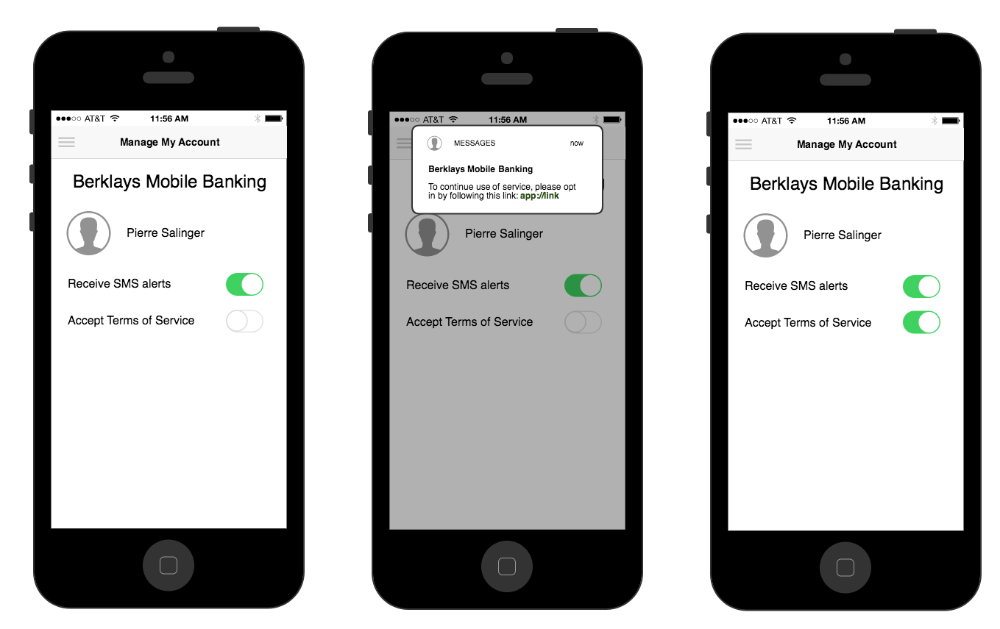

# GRDB Compliance Demo 

# Scenario

A Nexmo customer needs all their end users to opt in to their updated terms of service for GDPR compliance, so that they can continue to process data using e.g. US service providers like AWS.

For the purposes of this demo, the Nexmo customer's name is "Berklays Bank".

# Requirements

* Nexmo customer stores end user phone numbers in their system

* Nexmo customer has a flag indicating whether end user has opted in to updated terms of service or not

* Nexmo customer may only send opt-in requests to end user phone numbers which have been validated as real and not inactive

* Customers must provide proof of their decision to opt-in by interacting with 

* Nexmo customer application on their phone

# Wireframes
